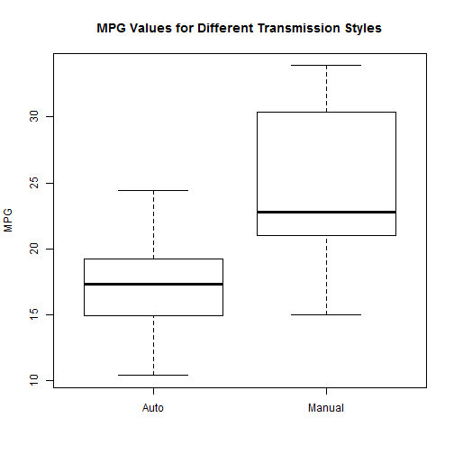
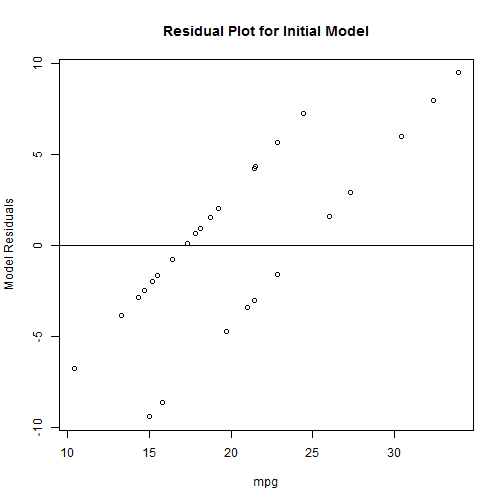
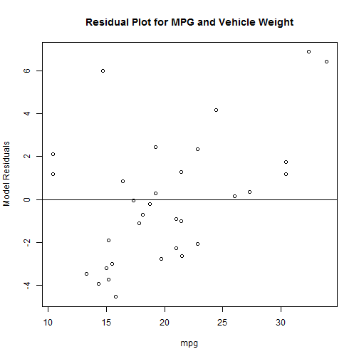

##Statistical Association between Automobile MPG and Transmission Style

***

***Principal Author***  
Dr. John R. Withrow, Jr.  
Cherokee Nation Technologies  
Contractor for USDA-FS FHTET  
NRRC Building A Ste 331  
2150 Centre Avenue  
Fort Collins, CO 80526  
john.withrow@fs.fed.us

***

###Exeutive Summary
Based upon the data provided, there is little observed statistical foundation for a relationship between transmission style and miles per gallon.  Although an initial statistical association is detected between these two variables, this statistical association is lost with the inclusion of a third variable, vehicle weight.  An appropriate interpretation of these findings would be to state that, although cars with manual transmissions do tend to have higher values of mpg, this difference appears to be due almost solely to the fact that cars with manual transmissions tend to be smaller than those with automatic transmissions.  Once knowledge of this reduced weight is added, knowing the style of transmission contributes little to any prediction of vehicle mpg.

***

###Analytical Context

####Session Info

```r
sessionInfo()
```

```
## R version 3.2.5 (2016-04-14)
## Platform: x86_64-w64-mingw32/x64 (64-bit)
## Running under: Windows >= 8 x64 (build 9200)
## 
## locale:
## [1] LC_COLLATE=English_United States.1252 
## [2] LC_CTYPE=English_United States.1252   
## [3] LC_MONETARY=English_United States.1252
## [4] LC_NUMERIC=C                          
## [5] LC_TIME=English_United States.1252    
## 
## attached base packages:
## [1] stats     graphics  grDevices utils     datasets  methods   base     
## 
## other attached packages:
## [1] MASS_7.3-45 car_2.1-2   swirl_2.4.1
## 
## loaded via a namespace (and not attached):
##  [1] Rcpp_0.12.4        knitr_1.13         magrittr_1.5      
##  [4] splines_3.2.5      lattice_0.20-33    R6_2.1.2          
##  [7] minqa_1.2.4        stringr_1.0.0      httr_1.1.0        
## [10] tools_3.2.5        nnet_7.3-12        pbkrtest_0.4-6    
## [13] parallel_3.2.5     grid_3.2.5         nlme_3.1-125      
## [16] mgcv_1.8-12        quantreg_5.26      htmltools_0.3.5   
## [19] MatrixModels_0.4-1 yaml_2.1.13        lme4_1.1-12       
## [22] digest_0.6.9       crayon_1.3.1       Matrix_1.2-4      
## [25] formatR_1.4        nloptr_1.0.4       bitops_1.0-6      
## [28] curl_0.9.7         RCurl_1.95-4.8     testthat_1.0.0    
## [31] evaluate_0.9       memoise_1.0.0      rmarkdown_0.9.6   
## [34] stringi_1.0-1      SparseM_1.7
```

####Random Number Seed

```r
set.seed(19680828)
```


***

###Data Acquisition

```r
library(datasets)
head(mtcars)
```

```
##                    mpg cyl disp  hp drat    wt  qsec vs am gear carb
## Mazda RX4         21.0   6  160 110 3.90 2.620 16.46  0  1    4    4
## Mazda RX4 Wag     21.0   6  160 110 3.90 2.875 17.02  0  1    4    4
## Datsun 710        22.8   4  108  93 3.85 2.320 18.61  1  1    4    1
## Hornet 4 Drive    21.4   6  258 110 3.08 3.215 19.44  1  0    3    1
## Hornet Sportabout 18.7   8  360 175 3.15 3.440 17.02  0  0    3    2
## Valiant           18.1   6  225 105 2.76 3.460 20.22  1  0    3    1
```

***

###Analytical Investigation
The help file for this dataset indicates the variable am as the indication of transmission style (0 = automatic and 1 = manual).  This combined with the variable mpg forms the most relevant variables of our investigation.  The initial plots as follows may be helpful:

```r
attach(mtcars)
```

```
## The following objects are masked from mtcars (pos = 3):
## 
##     am, carb, cyl, disp, drat, gear, hp, mpg, qsec, vs, wt
```

```
## The following objects are masked from mtcars (pos = 4):
## 
##     am, carb, cyl, disp, drat, gear, hp, mpg, qsec, vs, wt
```

```r
boxplot(mpg~am,names=c("Auto","Manual"),ylab="MPG")
title("MPG Values for Different Transmission Styles")
```



***

####Initial Model
These plots suggest that higher MPG values may be associated with manual transmissions.  For modeling this we begin with a simple linear model, which is theoretically inappropriate for a strictly nonzero response variable, but may prove to be sufficient in this case:

```r
mod1 <- lm(mpg ~ am)
summary(mod1)
```

```
## 
## Call:
## lm(formula = mpg ~ am)
## 
## Residuals:
##     Min      1Q  Median      3Q     Max 
## -9.3923 -3.0923 -0.2974  3.2439  9.5077 
## 
## Coefficients:
##             Estimate Std. Error t value Pr(>|t|)    
## (Intercept)   17.147      1.125  15.247 1.13e-15 ***
## am             7.245      1.764   4.106 0.000285 ***
## ---
## Signif. codes:  0 '***' 0.001 '**' 0.01 '*' 0.05 '.' 0.1 ' ' 1
## 
## Residual standard error: 4.902 on 30 degrees of freedom
## Multiple R-squared:  0.3598,	Adjusted R-squared:  0.3385 
## F-statistic: 16.86 on 1 and 30 DF,  p-value: 0.000285
```

A statistically significant distinction is detected.  More specifically, the model coefficients inicate an expected mpg of 17.15 for a car with an automatic transmission.  For a car with a manual transmission there is an expected increase of 7.25 miles per gallon for a total of about 24.4 miles per gallon.  A residual plot along with a Shapiro-Welk normality check on the residuals follows:

```r
plot(mpg,resid(mod1),ylab="Model Residuals",main="Residual Plot for Initial Model")
abline(0,0)
```



```r
shapiro.test(resid(mod1))
```

```
## 
## 	Shapiro-Wilk normality test
## 
## data:  resid(mod1)
## W = 0.98208, p-value = 0.8573
```

Departure from normality is not demonstrated with statistical significance, but the residuals indicate an obvious systematic departure from mutual independence.  Influence from another correlate is suspected.  

***

####Investigation of Other Variables
This initial analysis would suggest a strong relationship between mpg and transmission style.  However, this should be further investigated via an assessment of other possible correlates.  Indeed, if an important correlate is not included, Simpson's Paradox implies that the above findings may be misleading.  We now investigate this by checking which variables can provide a significant contribution to a more full model that predicts mpg.

We start by checking which variables other than transmission style seem to correlate well with mpg:

```r
vars <- sapply(2:11,function(n)cor(mtcars$mpg,mtcars[,n]))
names(vars) <- colnames(mtcars[2:11])
vars[order(abs(vars),decreasing=TRUE)]
```

```
##         wt        cyl       disp         hp       drat         vs 
## -0.8676594 -0.8521620 -0.8475514 -0.7761684  0.6811719  0.6640389 
##         am       carb       gear       qsec 
##  0.5998324 -0.5509251  0.4802848  0.4186840
```

where the variables have been rearranged in decreasing order of correlation strength.  The strongest association is an inverse correlation with vehicle weight (wt).  Adding this into the model:

```r
mod2 <- lm(mpg ~ am + wt)
summary(mod2)
```

```
## 
## Call:
## lm(formula = mpg ~ am + wt)
## 
## Residuals:
##     Min      1Q  Median      3Q     Max 
## -4.5295 -2.3619 -0.1317  1.4025  6.8782 
## 
## Coefficients:
##             Estimate Std. Error t value Pr(>|t|)    
## (Intercept) 37.32155    3.05464  12.218 5.84e-13 ***
## am          -0.02362    1.54565  -0.015    0.988    
## wt          -5.35281    0.78824  -6.791 1.87e-07 ***
## ---
## Signif. codes:  0 '***' 0.001 '**' 0.01 '*' 0.05 '.' 0.1 ' ' 1
## 
## Residual standard error: 3.098 on 29 degrees of freedom
## Multiple R-squared:  0.7528,	Adjusted R-squared:  0.7358 
## F-statistic: 44.17 on 2 and 29 DF,  p-value: 1.579e-09
```

Transmission style and weight appear to be strongly correlated themselves:

```r
cor(am,wt)
```

```
## [1] -0.6924953
```

This is expressed in terms of inflated variance in the parameter estimates:

```r
library(car)
vif(mod2)
```

```
##       am       wt 
## 1.921413 1.921413
```

However, even with the variance inflation, the new model is superior to the old:

```r
anova(mod1,mod2)
```

```
## Analysis of Variance Table
## 
## Model 1: mpg ~ am
## Model 2: mpg ~ am + wt
##   Res.Df    RSS Df Sum of Sq      F    Pr(>F)    
## 1     30 720.90                                  
## 2     29 278.32  1    442.58 46.115 1.867e-07 ***
## ---
## Signif. codes:  0 '***' 0.001 '**' 0.01 '*' 0.05 '.' 0.1 ' ' 1
```

It is also observed from the above model summary that with the inclusion of weight in the model, the parameter for transmission type loses its significance.  Immediately the validity of the initial findings are suspect as it appears that nearly all of the association between transmission style and mpg is explained by the negative association between mpg and vehicle weight.  In short, manual transmission cars tend to be smaller, and so once the vehicle weight is known, the additional knowledge of transmission style provides little additional information for estimating mpg.  The coefficient for weight indicates an expected drop in mpg of 5.35 miles per gallon for every 1000 pound increase in vehicle weight.  The coefficient for transmission style shows only an expected drop in mpg of 0.02 miles per gallon for switching to a manual transmission in a car of the same weight.  Lastly, the intercept coefficient implies an mpg value of 37.32 for a weightless car with an automatic transmission.

So far we have encountered a mild version of Simpson's Paradox, where an initial implied relationship is rendered invalid by the inclusion of an additional variable.  We investigate further with additional variables to see specifically if this relationship is ever regained:

```r
summary(lm(mpg ~ am + wt + cyl))$coefficients[2,4]
```

```
## [1] 0.8933421
```

```r
summary(lm(mpg ~ am + wt + cyl + disp))$coefficients[2,4]
```

```
## [1] 0.9229196
```

```r
summary(lm(mpg ~ am + wt + cyl + disp + hp))$coefficients[2,4]
```

```
## [1] 0.289843
```

```r
summary(lm(mpg ~ am + wt + cyl + disp + hp + drat))$coefficients[2,4]
```

```
## [1] 0.3890582
```

```r
summary(lm(mpg ~ am + wt + cyl + disp + hp + drat + vs))$coefficients[2,4]
```

```
## [1] 0.2774874
```

```r
summary(lm(mpg ~ am + wt + cyl + disp + hp + drat + vs + carb))$coefficients[2,4]
```

```
## [1] 0.2559206
```

```r
summary(lm(mpg ~ am + wt + cyl + disp + hp + drat + vs + carb + gear))$coefficients[2,4]
```

```
## [1] 0.3531649
```

```r
summary(lm(mpg ~ am + wt + cyl + disp + hp + drat + vs + carb + gear + qsec))$coefficients[2,4]
```

```
## [1] 0.2339897
```

With none of these p values ever dropping below 0.05, transmission style is not observed as regaining significance.  Hence, in regards to investigating a relationship between mpg and transmission style, we are now relegated to our previous two models.  We can actually try a third with vehicle weight only:

```r
mod1a <- lm(mpg ~ wt)
summary(mod1a)
```

```
## 
## Call:
## lm(formula = mpg ~ wt)
## 
## Residuals:
##     Min      1Q  Median      3Q     Max 
## -4.5432 -2.3647 -0.1252  1.4096  6.8727 
## 
## Coefficients:
##             Estimate Std. Error t value Pr(>|t|)    
## (Intercept)  37.2851     1.8776  19.858  < 2e-16 ***
## wt           -5.3445     0.5591  -9.559 1.29e-10 ***
## ---
## Signif. codes:  0 '***' 0.001 '**' 0.01 '*' 0.05 '.' 0.1 ' ' 1
## 
## Residual standard error: 3.046 on 30 degrees of freedom
## Multiple R-squared:  0.7528,	Adjusted R-squared:  0.7446 
## F-statistic: 91.38 on 1 and 30 DF,  p-value: 1.294e-10
```

```r
anova(mod1a,mod2)
```

```
## Analysis of Variance Table
## 
## Model 1: mpg ~ wt
## Model 2: mpg ~ am + wt
##   Res.Df    RSS Df Sum of Sq     F Pr(>F)
## 1     30 278.32                          
## 2     29 278.32  1 0.0022403 2e-04 0.9879
```

This confirms the fact that the effect of transmission style is dominated by vehicle weight by stating that once vehicle weight is included in the model, there is little statistical foundation for adding transmission style.

Residual analysis for the model relating vehicle weight (only) to mpg is as follows:

```r
plot(mpg,resid(mod2),ylab="Model Residuals",main="Residual Plot for MPG and Vehicle Weight")
abline(0,0)
```



```r
shapiro.test(resid(mod2))
```

```
## 
## 	Shapiro-Wilk normality test
## 
## data:  resid(mod2)
## W = 0.94478, p-value = 0.1024
```

Although the above shows a robust model between mpg and vehicle weight, more investigation would be necessary to confirm that this second association is not, again, dominated by or changed by the presence of another correlate.  Since the goal of this analysis was to specifically investigate the influence of transmission style, this is considered to be outside the scope of the present work.

The conclusions of this investigation are provided in the Executive Summary at top.

***
